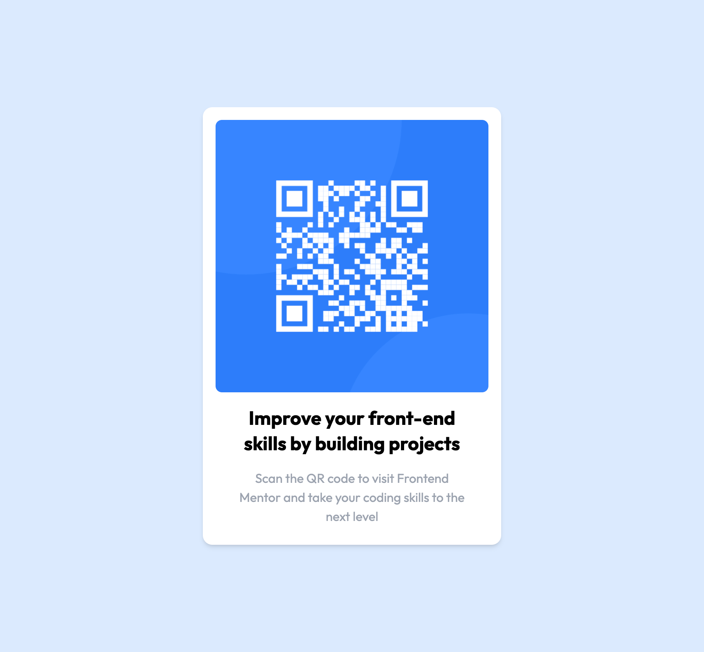

# Frontend Mentor - QR code component solution

This is a solution to the [QR code component challenge on Frontend Mentor](https://www.frontendmentor.io/challenges/qr-code-component-iux_sIO_H). Frontend Mentor challenges help you improve your coding skills by building realistic projects.

## Table of contents

- [Overview](#overview)
  - [Screenshot](#screenshot)
- [My process](#my-process)
  - [Built with](#built-with)
  - [Continued development](#continued-development)
  - [Useful resources](#useful-resources)
- [Author](#author)

**Note: Delete this note and update the table of contents based on what sections you keep.**

## Overview

### Screenshot

## My process

### Built with

- Semantic HTML5 markup
- CSS custom properties
- Flexbox
- CSS Grid
- Mobile-first workflow
- [React](https://reactjs.org/) - JS library

### Continued development

I would love to adapt this and use it for my portfolio website. Maybe have a little popup that gives a QR code linking to my CV.

### Useful resources

- [Tailwind CSS](https://tailwindcss.com/) - I used Tailwind for the styling.

## Author

- Website - [Ian Luong](https://ianluong.github.io)
- Frontend Mentor - [@yourusername](https://www.frontendmentor.io/profile/IanLuong)
